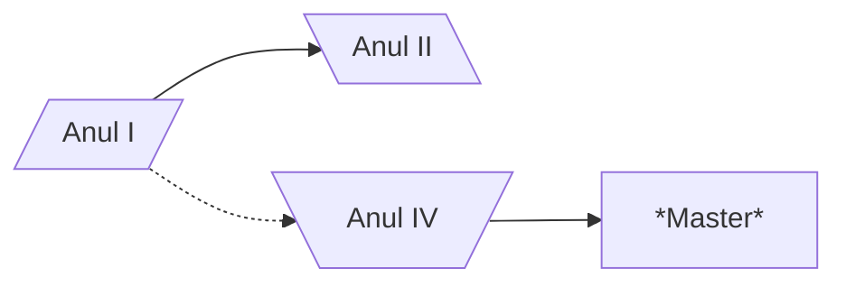
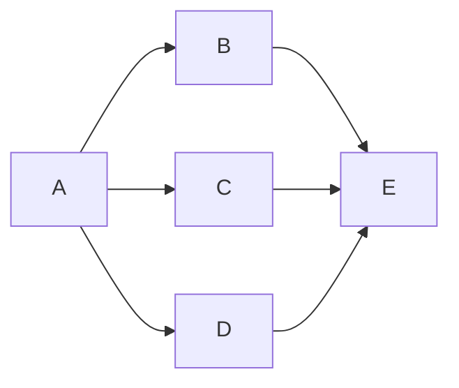

[Homepage](index.md)

# Diagrame de tip _Flowchart_

**De retinut:**
- diagramele _flowchart_ au noduri si conectori
- nodurile au:
  - **forma** (data de paranteze folosite la deschiderea _nodului_)
  - ID (sirul folosit in afara descrierii nodului)
  - descrierea (textul ce apare in caseta nodului si care este implementat in interiorul diferitelor tipuri de paranteze - ce decid forma casetei nodului)
- conectorii au:
  - diferite tipuri de sageti sau chiar pot activa fara sageti
  - diferite tipuri de linii:
    - `-->` linie continua(sageata dreapta)
    - `--` linie continua(fara sageti)
    - `<-->` linie continua(sageata dreapta si sageata stanga)
    - `==>` linie ingrosata  cu sageata stanga

## Diagrame _flowchart_ avansate

# Diagrame de tip _Timeline_

